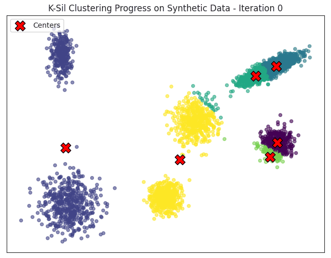
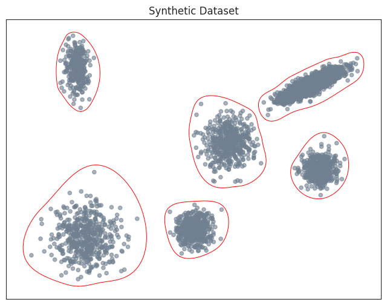
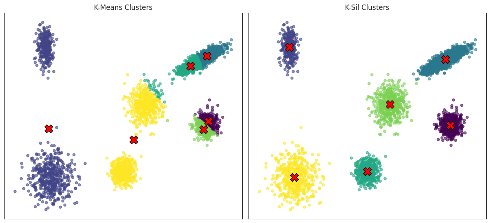

# K-Sil Clustering
K-Sil is a centroid-based clustering algorithm that extends *k*-means by integrating silhouette scores directly into the centroid update process to enhance clustering quality.
Unlike classic *k*-means, which treats all points equally, K-Sil dynamically weights data points in each iteration based on their silhouette scores through self-tuning, per cluster weighting schemes,
effectively increasing the influence of well-clustered, high-confidence regions on centroid updates, while suppressing the impact of outliers and noisy or unreliable instances. 
As a result, K-Sil reduces sensitivity to poor centroid initialization and yields clustering partitions that are both more accurate in capturing intrinsic data patterns and more resilient to noise, outliers, overlapping groups, and cluster imbalances.
It supports silhouette-based objectives, such as *Macro*-averaged Silhouette (cluster-level), *Micro*-averaged (point-level),
or their combination, enabling flexible emphasis during clustering and maintaining scalability through objective-aware sampling and efficient silhouette approximations.

<p align="center">
  <br/>
  <sub><em>
    K-Sil’s iterative centroid updates guided by silhouette-based weighting until convergence.
  </em></sub>
</p>

## K-Sil Components

### Silhouette Computation
Since K-Sil computes silhouette scores for all points at each iteration to guide instance weighting, it incorporates several mechanisms to ensure scalability to large datasets without compromising clustering quality. 
It employs adaptive sampling strategies that align with the selected silhouette aggregation objective: 
when using the *Macro*-averaged Silhouette (the per-cluster average silhouette score), K-Sil samples uniformly within each cluster to ensure balanced representation,
while for the *Micro*-averaged (the overall average score across all data points), it samples uniformly from the entire dataset. 
Additionally, to avoid the computational overhead of pairwise distance calculations, K-Sil provides an approximate silhouette option.
For each point, intra- and inter-cluster distances are estimated using centroid distances along with within-cluster dispersion (sum of squares), yielding more accurate approximations than standard centroid-based heuristics.
Although absolute values may slightly differ from exact silhouettes, the relative rankings remain highly consistent.
The refined approximation shows stronger alignment with the true silhouette distribution, both at the point level and in aggregated metrics, outperforming simpler proxies.
For *Spearman Rank* correlation analysis with the exact point-level silhouette scores, along with comparisons of dataset-level silhouette values, see the analysis in [silhouette_approx.ipynb](analysis/silhouette_approx.ipynb). 
Silhouette computation methods, including the approximations and appropriate sampling, are also available independently in [silhouette_methods.ipynb](analysis/silhouette_methods.ipynb) for flexible use outside the main K-Sil pipeline.

### Instance Weighting
K-Sil supports two alternative instance-weighting schemes based on silhouette scores—Power and Exponential—each suited to different cluster characteristics.
The Power scheme uses absolute silhouette scores within each cluster, shifted by the minimum and scaled by the cluster's median silhouette.
This approach emphasizes score differences directly and works well in homogeneous clusters, where well-clustered points are clearly distinguishable.
The Exponential scheme assigns weights based on the (dense) rank of each point’s silhouette score within its cluster, where higher silhouette scores receive lower (better) ranks.
The decay is centered around the median rank, and the rank differences are normalized to the maximum rank in the cluster, making the weighting contrast cluster-relative and scale-independent.
Because it relies on ordering rather than raw scores, this scheme is more robust in heterogeneous clusters and naturally compatible with silhouette approximations. 
Both weighting schemes are controlled by a **sensitivity** parameter, which adjusts the contrast between high and low confidence/quality points relative to the median silhouette in each cluster. 
Higher sensitivity values amplify weighting contrast, placing greater emphasis on well-clustered points and downweighting low-silhouette ones, while lower values soften distinctions, preserving influence from ambiguous instances. 
This parameter can be manually specified or auto-tuned via parallel coarse grid search to maximize the selected silhouette objective (*macro*, *micro*, or a combination). 
  
After weighting, each cluster's centroid is updated as the weighted average of its member points, moving toward high silhouette regions.
If a cluster becomes empty when reassigning points, K-Sil re-initializes it by selecting the point from the largest cluster (by size) that is farthest from its centroid.
K-Sil converges when the average centroid movement falls below a small threshold, typically sufficient for stable clustering. A maximum iteration limit also exists as a practical safeguard, though it is rarely reached in practice.
The final output (centroids, labels) corresponds to the partition that achieved the highest silhouette (objective) score during the run.

## Installation

**K-Sil** will be available on PyPI soon:

```bash
pip install ksil
```

Install directly from the GitHub repository:

```bash
pip install git+https://github.com/semoglou/ksil.git
```

## How to Use

### Configuration Options
The following **parameters** can be set when initializing a `KSil` model:

| Parameter              | Type            | Default      | Description                                                                   |
|------------------------|-----------------|--------------|-------------------------------------------------------------------------------|
| `n_clusters`           | int             | `3`          | Number of clusters to form                                                    |
| `init_method`          | str             | `"random"`   | `"random"` or `"k-means++"` centroid initialization                           |
| `max_iter`             | int             | `100`        | Maximum number of iterations                                                  |
| `random_state`         | int             | `42`         | Random seed for reproducibility                                               |
| `silhouette_objective` | str             | `"macro"`    | Objective: `"macro"`, `"micro"` (or `"convex"`)                               |
| `approximation`        | bool            | `False`      | Use silhouette approximation (faster for large datasets)                      |
| `sample_size`          | int / float     | `-1`         | Sample size: `-1` (full), fraction (0–1), or fixed count                      |
| `weighting`            | str             | `"power"`    | `"power"` or `"exponential"` weighting scheme                                 |
| `sensitivity`          | float / str     | `"auto"`     | Weight contrast: float or `"auto"` (grid search)                              |
| `alpha`                | float           | `0.5`        | Macro/micro tradeoff (used if the objective=`"convex"`)                       |
| `tol`                  | float           | `1e-4`       | Convergence threshold based on centroid movement                              |
| `n_jobs`               | int             | `-1`         | Number of parallel jobs (`-1` for all available cores)                        |

### Model Functions
Public **methods** for fitting, prediction, and analysis (expecting array-like datasets `[n_samples, n_features]`):

| Method                     | Description                                                       |
|----------------------------|-------------------------------------------------------------------|
| `fit(X)`                   | Fit the model on dataset `X`                                      |
| `predict(Y)`               | Predict cluster labels for data points in `Y` based on the fitted model|
| `transform(Z)`             | Transform data points in `Z` to distances to learned centroids     |
| `fit_predict(X)`           | Fit the model on `X` and return cluster labels                    |
| `fit_transform(X)`         | Fit the model and transform `X`                                   |

### Results
After fitting the model, the following **attributes** are available:

| Attribute           | Description                                                     |
|---------------------|-----------------------------------------------------------------|
| `labels_`           | Final cluster labels assigned to each data point                |
| `cluster_centers_`  | Learned centroids (as a pandas Series of coordinate lists)      |
| `n_iter_`           | Number of iterations until convergence                          |

## Quick Start
#### Fit K-Sil and Retrieve Cluster Labels & Centroids
```python
from ksil import KSil
import numpy as np

# Example dataset
X = np.array([
    [1, 2], 
    [1, 4], 
    [1, 5], 
    [2, 8],  
    [3, 6],  
    [5, 7] 
])

# Initialize the K-Sil model
ksil = KSil(n_clusters=2, silhouette_objective="macro")

# Fit the model to the dataset
ksil.fit(X)

# Get the number of iterations the algorithm took to converge
n_iter = ksil.n_iter_

# Retrieve the cluster labels (labels assigned to each data point in X)
labels = ksil.labels_

# Alternatively, fit the model and get cluster labels in one step
# labels = KSil(n_clusters=2).fit_predict(X)

# Retrieve the cluster centroids (learned center points of each cluster)
centroids = ksil.cluster_centers_
# Use np.array(ksil.cluster_centers_) if you prefer the centroids in NumPy array format

print(f"Iterations: {n_iter}")
print(f"Cluster Labels: {labels}")
print(f"Cluster Centroids:\n {centroids}")
```
Output:
```
Iterations: 2
Cluster Labels: [0 0 0 1 1 1]
Cluster Centroids:
0    [1.5, 4.25]
1    [3.5, 7.5]
```

#### Predict Labels and Transform Data
```python
# Assuming the K-Sil model has already been fitted in the previous cell

# New data for prediction and transformation
new_data = np.array([
    [2, 3], 
    [4, 5]
])

# Predict the cluster labels for the new data points based on the fitted model
pred_labels = ksil.predict(new_data)

# Transform the new data points into distances to the previously learned centroids
transformation = ksil.transform(new_data)

print(f"Predicted Labels for New Data: {pred_labels}")
print(f"Transformed New Data (Distances to Centroids):\n {transformation}")
```
Output:
```
Predicted Labels for New Data: [0 1]
Transformed New Data (Distances to Centroids):
[[1.3462912  4.74341649]
 [2.61007663 2.54950976]]
```
For a detailed example exploring additional aspects such as sampling and approximations, check out this [notebook](./analysis/functionality.ipynb).

## Clustering Performance

K-Sil demonstrates consistent and statistically significant improvements over *k*-means in clustering quality,
as measured by silhouette scores (both *macro* and *micro*) across synthetic and real world datasets.
Higher Normalized Mutual Information (NMI) scores are also observed on synthetic datasets, where ground truth labels allow for such evaluation.   
K-Sil’s most substantial improvements occur for the *Macro*-averaged Silhouette score (when also configured to prioritize this objective).
By design, its cluster-centric weighting strategy, which emphasizes well-clustered instances and de-emphasizes uncertain ones within each cluster, 
naturally aligns with the macro objective’s focus on cluster-level quality.
This makes K-Sil particularly effective for detecting subtle patterns, preserving minority groups,
and ensuring fair representation in heterogeneous data.  
> **Note:** Although K-Sil improves clustering quality by integrating silhouette-based weighting, it can still be influenced by the initial placement of centroids.
>  To improve stability and consistency, it’s recommended to run the algorithm multiple times with different initializations (`random_state` values) and select the result with the best silhouette (objective) score.


For a comprehensive evaluation of K-Sil on synthetic and real-world datasets, including statistical comparisons, performance benchmarks,
and detailed results on *macro*-/*micro*-averaged silhouette and NMI, see the notebooks in the [`analysis/`](analysis/) folder, 
particularly [ksil_performance.ipynb](./analysis/ksil_performance.ipynb).
<p align="center">
  <br/>
  <sub><em>
    Synthetic data with varied cluster shapes and densities.
  </em></sub>
</p>

<p align="center">
  <br/>
  <sub><em>
    Cluster assignments by K-Means (left) and K-Sil (right), both initialized with the same centroids.<br/>
    K-Sil configured with <code>silhouette_objective="macro"</code>, <code>sensitivity=1</code> (no <code>"auto"</code> grid search applied).<br/>
    (Final cluster centroids marked in red <code><strong>X</strong></code>)
  </em></sub>
</p>

## License

This project is licensed under the [MIT License](LICENSE).
