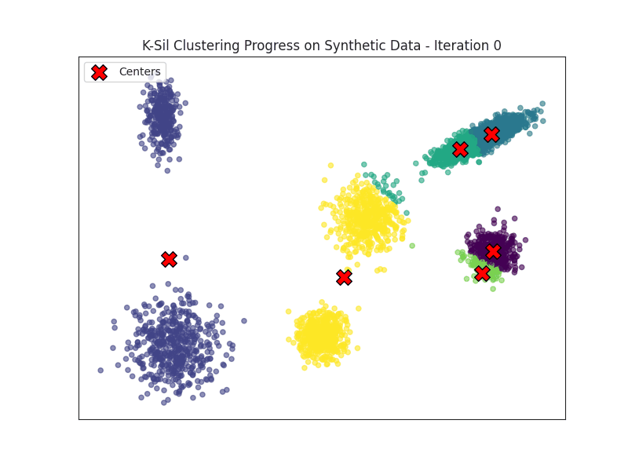

# K-Sil Clustering
K-Sil is a silhouette-guided refinement of the classic K-Means algorithm that produces more cohesive and well-separated clusters. Unlike standard K-Means, which treats all points equally, K-Sil dynamically weights data points based on their silhouette scores per cluster via self-tuning weighting schemes — emphasizing well-clustered instances and downweighting noisy or ambiguous ones. It supports macro-averaged, micro-averaged, or hybrid silhouette objectives, and leverages adaptive sampling and scalable silhouette approximations for efficiency. K-Sil offers a principled and robust alternative for high-quality clustering.

<p align="center">
  
</p>

## Overview

## Installation

You can install **K-Sil** from PyPI:

```bash
pip install ksil
```

or directly from the GitHub repository:

```bash
pip install git+https://github.com/semoglou/ksil.git
```

## How to Use

### Configuration Options
The following **parameters** can be set when initializing a `KSil` model:

| Parameter              | Type            | Default      | Description                                                                   |
|------------------------|-----------------|--------------|-------------------------------------------------------------------------------|
| `n_clusters`           | int             | `3`          | Number of clusters to form                                                    |
| `init_method`          | str             | `"random"`   | `"random"` or `"k-means++"` centroid initialization                           |
| `max_iter`             | int             | `100`        | Maximum number of iterations                                                  |
| `random_state`         | int             | `42`         | Random seed for reproducibility                                               |
| `silhouette_objective` | str             | `"macro"`    | Objective: `"micro"`, `"macro"`, or `"convex"`                                |
| `approximation`        | bool            | `False`      | Use silhouette approximation (faster for large datasets)                      |
| `sample_size`          | int / float     | `-1`         | Sample size: `-1` (full), fraction (0–1), or fixed count                      |
| `weighting`            | str             | `"power"`    | `"power"` or `"exponential"` weighting scheme                                 |
| `sensitivity`          | float / str     | `"auto"`     | Weight contrast: float or `"auto"` (grid search)                              |
| `alpha`                | float           | `0.5`        | Macro/micro tradeoff if using `"convex"` objective                            |
| `tol`                  | float           | `1e-4`       | Convergence threshold based on centroid movement                              |
| `n_jobs`               | int             | `-1`         | Number of parallel jobs (`-1` for all available cores)                        |

### Model Functions
Public **methods** for fitting, prediction, and analysis (all expecting array-like datasets of shape `[n_samples, n_features]`):

| Method                     | Description                                                       |
|----------------------------|-------------------------------------------------------------------|
| `fit(X)`                   | Fit the model on dataset `X`                                      |
| `predict(Y)`               | Predict cluster labels for data points in `Y` based on the fitted model|
| `transform(Z)`             | Transform data points in `Z` to distances to learned centroids     |
| `fit_predict(X)`           | Fit the model on `X` and return cluster labels                    |
| `fit_transform(X)`         | Fit the model and transform `X`                                   |

### Results
After fitting the model, the following **attributes** are available:

| Attribute           | Description                                                     |
|---------------------|-----------------------------------------------------------------|
| `labels_`           | Final cluster labels assigned to each data point                |
| `cluster_centers_`  | Learned centroids (as a pandas Series of coordinate lists)      |
| `n_iter_`           | Number of iterations until convergence                          |

## Quick Start
#### Fit K-Sil and Retrieve Cluster Labels & Centroids
```python
from ksil import KSil
import numpy as np

# Example dataset
X = np.array([
    [1, 2], 
    [1, 4], 
    [1, 5], 
    [2, 8],  
    [3, 6],  
    [5, 7] 
])

# Initialize the K-Sil model
ksil = KSil(n_clusters=2, silhouette_objective="macro")

# Fit the model to the dataset
ksil.fit(X)

# Get the number of iterations the algorithm took to converge
n_iter = ksil.n_iter_

# Retrieve the cluster labels (labels assigned to each data point in X)
labels = ksil.labels_

# Alternatively, fit the model and get cluster labels in one step
# labels = KSil(n_clusters=2).fit_predict(X)

# Retrieve the cluster centroids (learned center points of each cluster)
centroids = ksil.cluster_centers_
# Use np.array(ksil.cluster_centers_) if you prefer the centroids in NumPy array format

print(f"Iterations: {n_iter}")
print(f"Cluster Labels: {labels}")
print(f"Cluster Centroids:\n {centroids}")
```
Output:
```
Iterations: 2
Cluster Centroids: [0 0 0 1 1 1]
Cluster Labels:
0    [1.5, 4.25]
1    [3.5, 7.5]
```

#### Predict Labels and Transform Data
```python
# Assuming the K-Sil model has already been fitted in the previous cell

# New data for prediction and transformation
new_data = np.array([
    [2, 3], 
    [4, 5]
])

# Predict the cluster labels for the new data points based on the fitted model
pred_labels = ksil.predict(new_data)

# Transform the new data points into distances to the previously learned centroids
transformation = ksil.transform(new_data)

print(f"Predicted Labels for New Data: {pred_labels}")
print(f"Transformed New Data (Distances to Centroids):\n {transformation}")
```
Output:
```
Predicted Labels for New Data: [0 1]
Transformed New Data (Distances to Centroids):
[[1.3462912  4.74341649]
 [2.61007663 2.54950976]]
```
For a detailed example exploring additional aspects such as sampling and approximations, check out this [notebook](./analysis/functionality.ipynb).

#

<sub>K-Sil · v0.1.0 · Last updated: 05/2025 · MIT License</sub>
